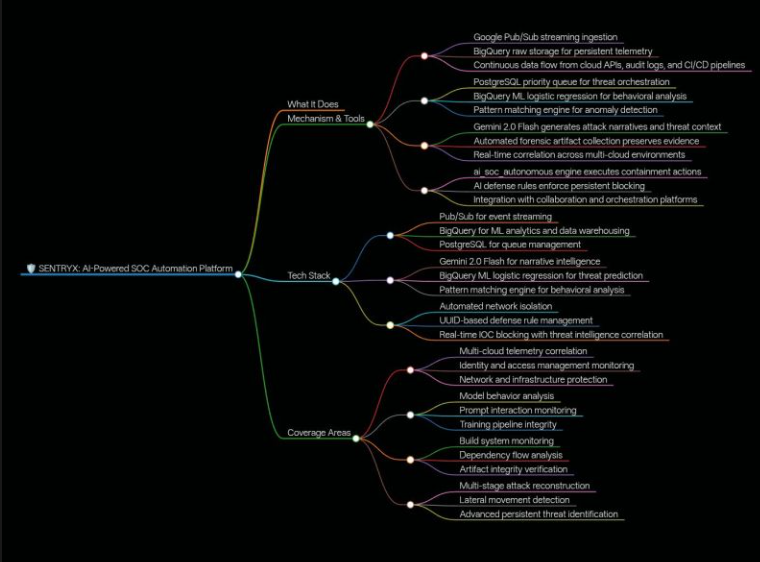

# SENTRYX: Autonomous AI-SOC & Security Engineering Portfolio

**SENTRYX** is a stateless, AI-native Security Operations Center (SOC) architecture designed to automate L1/L2 telemetry triage, establish ML-driven classification boundaries for autonomous containment, and enforce Detection-as-Code (DaC) CI/CD pipelines.

* **Recognition:** Evaluated at a €300,000 valuation tier by the EWOR Fellowship Program (Europe).
* **Core Technologies:** Google Cloud Platform (Pub/Sub, BigQuery ML), Gemini 2.0 Flash, Python, GitHub Actions.

---

## 1. Enterprise Architecture & Telemetry Ingestion
The pipeline ingests raw JSON telemetry, routes it through cloud-native message brokers, and processes it via LLM and ML modules to generate automated root-cause analysis (RCA) and trigger defensive containment.

---

## 2. ML Confidence Boundary & Automated Triage
SENTRYX utilizes a **BigQuery ML logistic regression model** to evaluate threat certainty, triggering autonomous containment protocols only when the model predicts malicious intent with extremely high statistical confidence. 

Instead of forcing human analysts to read raw telemetry, **Gemini 2.0 Flash** is integrated directly into the pipeline to parse JSON logs, map the behavior to the MITRE ATT&CK framework, assign a severity score, and generate a human-readable RCA narrative.

*(Core backend processing modules — see CI/CD and auxiliary tools below for codebase validation).*

---

## 3. Detection-as-Code (DaC) & CI/CD Validation
To ensure deployment resilience and eliminate false positives, threat detection logic is engineered as code. All detection rules (written in Sigma format) are pushed through an automated GitHub Actions CI/CD pipeline, bridging theoretical detection with DevSecOps best practices.

**Automated CI/CD GitHub Actions Pipeline:**

**PyTest Validation against Synthetic Attack Simulations:**

**Sigma Rule Engineering Mapped to MITRE ATT&CK (T1059.001):**

---

## 4. AI-Powered Phishing Detection & Explainable AI (XAI)
To combat sophisticated social engineering, I engineered an AI-driven phishing classifier. Beyond simple binary classification, the model extracts active Indicators of Compromise (IOCs), maps the threat to MITRE ATT&CK (T1566), and utilizes **SHAP (SHapley Additive exPlanations)** to provide transparent, explainable AI (XAI) insights into which specific text features triggered the classification.

**Phishing Triage & IOC Extraction:**

**Explainable AI (SHAP Force Plots) for Analyst Transparency:**

---

## 5. Automated Cloud Misconfiguration Scanner
To secure the underlying infrastructure, I built a cloud-native vulnerability scanner designed to audit GCP environments and process synthetic cross-cloud telemetry. The scanner enumerates assets, evaluates configurations against security baselines (e.g., exposed Cloud Storage buckets, excessive IAM permissions), and automatically generates structured JSON reports with actionable remediation steps.

**Cloud Asset Enumeration & Vulnerability Auditing:**

**Automated Remediation Workflows:**

---

## 6. Backend Codebase & Orchestration Pipeline
This repository contains the raw Python and Bash execution scripts that power the SENTRYX autonomous pipeline. Key infrastructure files include:

* **Threat Simulation (`sophisticated_attacks.py`):** Generates highly advanced, synthetic attack payloads (e.g., LLM Prompt Injection, Kubernetes eBPF rootkits, TensorFlow data poisoning) to validate pipeline resilience.
* **Streaming Ingestion (`pubsub_bq_bridge.py`):** Python subscriber client that continuously listens to Google Cloud Pub/Sub, batches telemetry, and streams it directly into BigQuery in real-time.
* **AI Integration (`layer4_ai_analysis.py` & `layer5_narratives.py`):** Vertex AI orchestration scripts that prompt Gemini 2.0 Flash to output structured JSON triage data and human-readable RCA narratives.
* **Machine Learning (`layer6_ml_predictions.py`):** SQL-wrapped Python logic to train, evaluate, and execute the logistic regression model directly within the BigQuery data warehouse.
